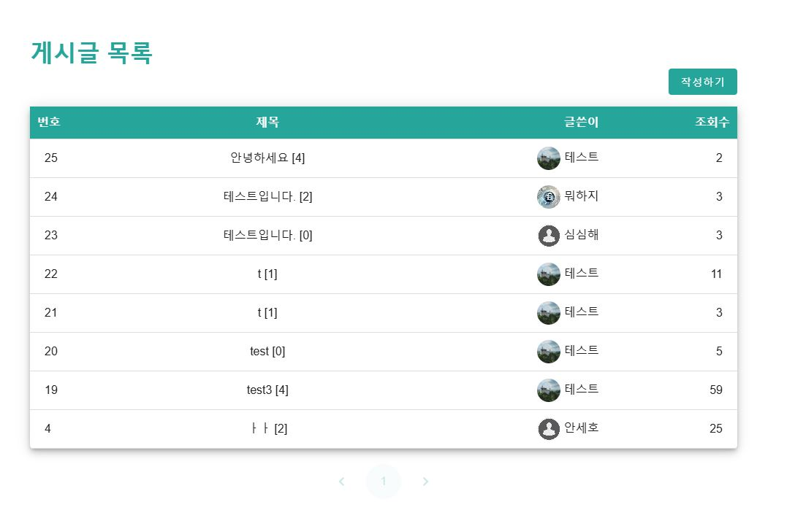

### 목차
1. [🙋 팀원 정보 및 업무 분담 내역]
2. [📊 설계 내용 (아키텍처 등) 및 실제 구현 정도]
3. [📑 데이터베이스 모델링(ERD)]
4. [💻 금융 상품 추천 알고리즘에 대한 기술적 설명]
5. [💁 서비스 대표 기능들에 대한 설명]
6. 생성형 AI 를 활용한 부분
7. [🙇 느낀 점, 후기 등]
---

## 🙋 팀원 정보 및 업무 분담 내역  
**프로젝트 기간**: 2024/11/18(월) ~ 2024/11/27(수)

|이름|역할 및 구현 기능|
|---|---|
|안세호 (팀장) |ERD, 회원 커스터마이징, 회원가입, 로그인, 마이페이지, 금융 상품 비교, 환율 계산기, 주변 은행 검색, 게시판 CRUD, 상품 관리, 유저 프로필 수정 기능, 금융 상품 정보 저장 |
|김태호|- 환율 정보 저장 및 업데이트, 금융 상품 정렬 및 필터링, 금융 상품 회원 저장, 주변 은행 검색, 환율 계산기, 주변 은행 검색, Chatbot 구현, 메인페이지 구성 |

### 🖥 **기술 스택**  

#### 🌕 **Front End**  
- **Language**: JavaScript  
- **Framework**: Vue3  
- **State Management**: Pinia (+pinia-plugin-persistedstate)  
- **UI Library**: Vuetify  
- **HTTP Library**: Axios  
- **Charting Library**: Chart.js  

#### 🌑 **Back End**  
- **Language**: Python  
- **Framework**: Django, Django REST Framework  
- **Authentication**: dj-rest-auth  
- **API Documentation**: drf-spectacular  

---

## 📊 설계 내용 (아키텍처 등) 및 실제 구현 정도  
  * 파트 나누기
  * 필수 기능을 정리하고 필요한 데이터, 참고자료를 수집하고, 데이터 의존도, 작업 우선도를 판단하여 진행 순서를 
    1. 회원가입
    2. 예적금 금리 비교
    3. 환율 계산
    4. 게시판
    5. 은행 검색
    6. 상품 추천
    7. AI 기능
  * 스타일링은 vuetify를 사용 / 페이지 기본 색상과 컨셉 결정
---

## 데이터베이스 모델링(ERD) ##
ERD 작성

---

---
## 결과 화면 ##
**< 메인페이지 >**
  

**< 회원가입 >**    
  

**< 로그인 >**  
  

**< 프로필 >**  
  

**< 프로필(detail) >**  
  

**< 주변 은행 찾기 >**  
  

**< 환율 계산기 >**  
  

**< 커뮤니티 >**  
  

**< 커뮤니티(detail) >**  
  

**< 챗봇 >**  
  
 
 
 

## 금융 상품 추천 알고리즘에 대한 기술적 설명 ##

### 구현 방식
1. **데이터 수집 및 저장**
   - 금융감독원 오픈 API를 활용하여 국내 주요 금융 상품 정보를 실시간으로 수집.
   - 수집된 데이터를 구조화하여 Django 기반 데이터베이스에 저장. 
   - 금융 상품의 금리, 조건, 특화 혜택 등 주요 속성을 체계적으로 관리하여 추천에 활용.

2. **추천 엔진: ChatGPT 활용**
   - ChatGPT를 추천 알고리즘의 핵심으로 활용, 대규모 언어 모델의 이해 능력을 통해 사용자와 금융 상품의 최적 매칭을 제공.
   - 사용자가 입력한 니즈(목적, 금액, 기간 등)를 기반으로 금융 상품 데이터에서 최적의 옵션을 분석.
   - 자연어 처리를 통해 복잡한 사용자 요청을 정제하여 가장 관련성 높은 금융 상품을 도출.

3. **추천 프로세스**
   - **입력 분석**: 사용자가 제공한 정보(예: "1년 만기, 금리가 높은 상품")를 ChatGPT가 이해 및 정제.
   - **데이터 검색**: 금융감독원 API에서 수집한 데이터베이스를 기반으로 조건에 맞는 상품 검색.
   - **우선순위 분석**: 금리, 가입 조건, 제한 요소 등을 평가하여 적합도 순으로 정렬.
   - **결과 제공**: 사용자에게 가장 적합한 금융 상품을 추천하며, 선택의 이유와 장점을 함께 제공하여 신뢰도를 높임.

---

## 서비스 대표 기능들에 대한 설명 ##

  * 상품 비교
    * 적금 예금 상품 목록을 출력하고 상품에 자세한 정보를 볼 수 있는 페이지를 구현
    * 상세 상품 페이지에서 상품을 가입/해지 기능과 이자률 순서대로  상품을 정렬하는 기능 추가
    - 상품 데이터 저장 url로 요청을 보내면 금융감독원 Open API를 활용해 백엔드 서버의 데이터베이스에 금융 상품 데이터를 저장
    - 상품 데이터에 대한 정보를 요청하는 url로 요청을 보내면 데이터베이스에 저장된 금융 상품 데이터를 응답

  * 주위 은행 찾기
    * 카카오맵 API를 이용하여 주위 은행을 찾아 지도를 출력
    * 시/군/구 단위로 나누어서 검색 가능

  * 환율 계산기 / 환율 변동 그래프
    * 한국수출입은행 환율 API데이터를 바탕으로 환율을 계산
    * 약 20가지의 환율 데이터 제공
    * 메인 페이지에서 최근 1년간의 원-달러 환율 추이 그래프 작성

  * 게시판
    * 게시판은 회원만 글쓰기, 댓글쓰기가 가능하며, 조회수, 게시글 번호 표시

  * 프로필 페이지
    * 프로필 페이지는 개인 프로필, 가입한 상품과 상품의 금리정보로 구성.
    * 프로필 수정으로 닉네임, 이메일 주소, 프로필 사진 수정이 가능하며 나이, 주소도 추가 가능 
    * 가입한 상품과 금리정보를 그래프로 표시.

---

## 생성형 AI 를 활용한 부분 ##
챗봇 + 캐러셀 이미지 + 로고

---

## 기타(느낀 점, 후기 등) ##
* 안세호 : 시간이 생각보다 소요가 많이되어 원하는만큼 구현을 하지 못했던 것 같습니다.
 하지만 이제 첫 프로젝트였를 마쳤으니 다른 사이드 프로젝트를 따로 진행하여 경험을 더 쌓을 수 있도록 노력하겠습니다.

* 김태호 : 약 10일간의 짧은 프로젝트를 진행하면서 많이 부족함을 느꼈었던 것 같습니다.
2학기에도 많은 시간을 들여 프로젝트를 하게 될 것인데, 배운것을 복습하고, spring, react 를 
미리 방학기간동안 익혀두면 좋을것 같다는 생각을 했습니다.
